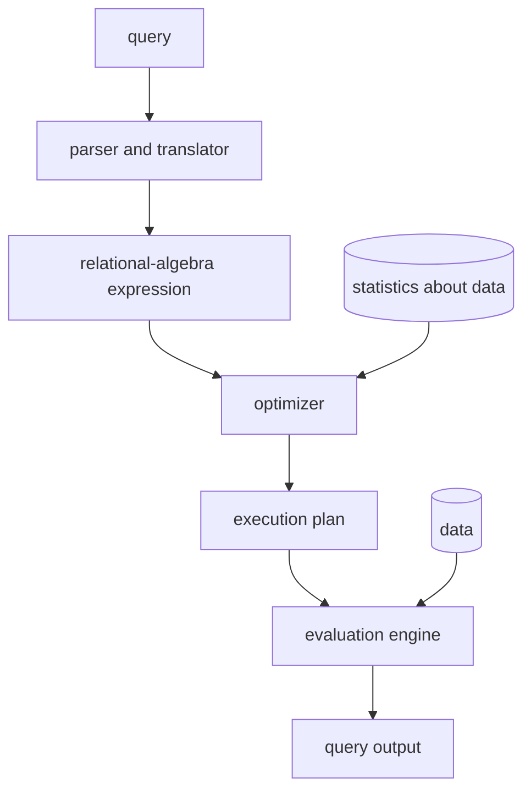

# ch15 — Query Processing

> Extracted from `raw/ch15.pptx` (63 slides, Database System Concepts 7th ed., Silberschatz/Korth/Sudarshan).
> Figures embedded as images are reconstructed as ASCII/mermaid diagrams; math notation lost in the raw
> export (σ, Π, ⨝, ⌈⌉, ≤, ∧, ∨, ∪, ∩, −) has been restored.

## Slide 1 — Chapter 15: Query Processing

## Slide 2 — Outline

- Overview
- Measures of Query Cost
- Selection Operation
- Sorting
- Join Operation
- Other Operations
- Evaluation of Expressions

## Slide 3 — Basic Steps in Query Processing

1. Parsing and translation
2. Optimization
3. Evaluation



## Slide 4 — Basic Steps in Query Processing (Cont.)

- **Parsing and translation**
  - Translate the query into its internal form. This is then translated into relational algebra.
  - Parser checks syntax, verifies relations
- **Evaluation**
  - The query-execution engine takes a query-evaluation plan, executes that plan, and returns the answers to the query.

## Slide 5 — Basic Steps in Query Processing: Optimization

- A relational algebra expression may have many equivalent expressions
  - E.g., σ_salary<75000(Π_salary(instructor)) is equivalent to Π_salary(σ_salary<75000(instructor))
- Each relational algebra operation can be evaluated using one of several different algorithms
  - Correspondingly, a relational-algebra expression can be evaluated in many ways.
- Annotated expression specifying detailed evaluation strategy is called an **evaluation-plan**. E.g.:
  - Use an index on salary to find instructors with salary < 75000,
  - Or perform complete relation scan and discard instructors with salary ≥ 75000

## Slide 6 — Basic Steps: Optimization (Cont.)

- **Query Optimization**: Amongst all equivalent evaluation plans choose the one with lowest cost.
  - Cost is estimated using statistical information from the database catalog
    - e.g. number of tuples in each relation, size of tuples, etc.
- In this chapter we study
  - How to measure query costs
  - Algorithms for evaluating relational algebra operations
  - How to combine algorithms for individual operations in order to evaluate a complete expression
- In Chapter 16
  - We study how to optimize queries, that is, how to find an evaluation plan with lowest estimated cost

## Slide 7 — Measures of Query Cost

- Many factors contribute to time cost
  - disk access, CPU, and network communication
- Cost can be measured based on
  - **response time**, i.e. total elapsed time for answering query, or
  - **total resource consumption**
- We use total resource consumption as cost metric
  - Response time harder to estimate, and minimizing resource consumption is a good idea in a shared database
- We ignore CPU costs for simplicity
  - Real systems do take CPU cost into account
  - Network costs must be considered for parallel systems
- We describe how to estimate the cost of each operation
  - We do not include cost of writing output to disk

## Slide 8 — Measures of Query Cost

- Disk cost can be estimated as:
  - Number of seeks × average-seek-cost
  - Number of blocks read × average-block-read-cost
  - Number of blocks written × average-block-write-cost
- For simplicity we just use the number of block transfers from disk and the number of seeks as the cost measures
  - **tT** — time to transfer one block
    - Assuming for simplicity that write cost is same as read cost
  - **tS** — time for one seek
  - Cost for b block transfers plus S seeks: **b × tT + S × tS**
- tS and tT depend on where data is stored; with 4 KB blocks:
  - High end magnetic disk: tS = 4 msec and tT = 0.1 msec
  - SSD: tS = 20–90 microsec and tT = 2–10 microsec for 4KB

## Slide 9 — Measures of Query Cost (Cont.)

- Required data may be buffer resident already, avoiding disk I/O
  - But hard to take into account for cost estimation
- Several algorithms can reduce disk IO by using extra buffer space
  - Amount of real memory available to buffer depends on other concurrent queries and OS processes, known only during execution
- Worst case estimates assume that no data is initially in buffer and only the minimum amount of memory needed for the operation is available
  - But more optimistic estimates are used in practice

## Slide 10 — Selection Operation

- **File scan**
- **Algorithm A1 (linear search)**. Scan each file block and test all records to see whether they satisfy the selection condition.
  - Cost estimate = br block transfers + 1 seek
    - br denotes number of blocks containing records from relation r
  - If selection is on a key attribute, can stop on finding record
    - cost = (br / 2) block transfers + 1 seek
  - Linear search can be applied regardless of
    - selection condition, or
    - ordering of records in the file, or
    - availability of indices
- Note: binary search generally does not make sense since data is not stored consecutively
  - except when there is an index available,
  - and binary search requires more seeks than index search

## Slide 11 — Selections Using Indices

- **Index scan** — search algorithms that use an index
  - selection condition must be on search-key of index.
- **A2 (clustering index, equality on key)**. Retrieve a single record that satisfies the corresponding equality condition
  - Cost = (hi + 1) × (tT + tS)
- **A3 (clustering index, equality on nonkey)**. Retrieve multiple records.
  - Records will be on consecutive blocks
    - Let b = number of blocks containing matching records
  - Cost = hi × (tT + tS) + tS + tT × b

## Slide 12 — Selections Using Indices (Cont.)

- **A4 (secondary index, equality on key/non-key)**.
  - Retrieve a single record if the search-key is a candidate key
    - Cost = (hi + 1) × (tT + tS)
  - Retrieve multiple records if search-key is not a candidate key
    - each of n matching records may be on a different block
    - Cost = (hi + n) × (tT + tS)
      - Can be very expensive!

## Slide 13 — Selections Involving Comparisons

- Can implement selections of the form σ_A≤V(r) or σ_A≥V(r) by using
  - a linear file scan,
  - or by using indices in the following ways:
- **A5 (clustering index, comparison)**. (Relation is sorted on A)
  - For σ_A≥V(r) use index to find first tuple ≥ v and scan relation sequentially from there
  - For σ_A≤V(r) just scan relation sequentially till first tuple > v; do not use index
- **A6 (secondary index, comparison)**.
  - For σ_A≥V(r) use index to find first index entry ≥ v and scan index sequentially from there, to find pointers to records.
  - For σ_A≤V(r) just scan leaf pages of index finding pointers to records, till first entry > v
  - In either case, retrieve records that are pointed to
    - requires an I/O per record; linear file scan may be cheaper!

## Slide 14 — Implementation of Complex Selections

- **Conjunction**: σ_θ1∧θ2∧…∧θn(r)
- **A7 (conjunctive selection using one index)**.
  - Select a combination of θi and algorithms A1 through A6 that results in the least cost for σ_θi(r).
  - Test other conditions on tuple after fetching it into memory buffer.
- **A8 (conjunctive selection using composite index)**.
  - Use appropriate composite (multiple-key) index if available.
- **A9 (conjunctive selection by intersection of identifiers)**.
  - Requires indices with record pointers.
  - Use corresponding index for each condition, and take intersection of all the obtained sets of record pointers.
  - Then fetch records from file
  - If some conditions do not have appropriate indices, apply test in memory.

## Slide 15 — Algorithms for Complex Selections

- **Disjunction**: σ_θ1∨θ2∨…∨θn(r)
- **A10 (disjunctive selection by union of identifiers)**.
  - Applicable if all conditions have available indices.
    - Otherwise use linear scan.
  - Use corresponding index for each condition, and take union of all the obtained sets of record pointers.
  - Then fetch records from file
- **Negation**: σ_¬θ(r)
  - Use linear scan on file
  - If very few records satisfy ¬θ, and an index is applicable to θ
    - Find satisfying records using index and fetch from file

## Slide 16 — Bitmap Index Scan

- The **bitmap index scan** algorithm of PostgreSQL
  - Bridges gap between secondary index scan and linear file scan when number of matching records is not known before execution
  - Bitmap with 1 bit per page in relation
  - Steps:
    - Index scan used to find record ids, and set bit of corresponding page in bitmap
    - Linear file scan fetching only pages with bit set to 1
  - Performance
    - Similar to index scan when only a few bits are set
    - Similar to linear file scan when most bits are set
    - Never behaves very badly compared to best alternative

## Slide 17 — Sorting

- We may build an index on the relation, and then use the index to read the relation in sorted order. May lead to one disk block access for each tuple.
- For relations that fit in memory, techniques like quicksort can be used.
- For relations that don't fit in memory, **external sort-merge** is a good choice.

## Slide 18 — Example: External Sorting Using Sort-Merge

```text
initial          create runs        merge pass-1      merge pass-2
relation         (M = 3)            (M-1 = 2 way)     (final result)
┌──────┐         ┌──────┐           ┌──────┐          ┌──────┐
│ g 24 │         │ a 19 │           │ a 19 │          │ a 14 │
│ a 19 │         │ d 31 │ run 1     │ b 14 │          │ a 19 │
│ d 31 │         │ g 24 │           │ c 33 │          │ b 14 │
│ c 33 │         ├──────┤           │ d 31 │ run 1'   │ c 33 │
│ b 14 │  ═══▶   │ b 14 │  ═══▶     │ e 16 │  ═══▶    │ d 7  │
│ e 16 │         │ c 33 │ run 2     │ g 24 │          │ d 21 │
│ r 16 │         │ e 16 │           ├──────┤          │ d 31 │
│ d 21 │         ├──────┤           │ a 14 │          │ e 16 │
│ m 3  │         │ d 21 │           │ d 7  │          │ g 24 │
│ p 2  │         │ m 3  │ run 3     │ d 21 │ run 2'   │ m 3  │
│ d 7  │         │ r 16 │           │ m 3  │          │ p 2  │
│ a 14 │         ├──────┤           │ p 2  │          │ r 16 │
└──────┘         │ a 14 │           │ r 16 │          └──────┘
                 │ d 7  │ run 4     └──────┘
                 │ p 2  │
                 └──────┘
```

## Slide 19 — External Sort-Merge

Let M denote memory size (in pages).

1. **Create sorted runs**. Let i be 0 initially. Repeatedly do the following till the end of the relation:
   - (a) Read M blocks of relation into memory
   - (b) Sort the in-memory blocks
   - (c) Write sorted data to run Ri; increment i.

   Let the final value of i be N.
2. **Merge the runs** (next slide)…

## Slide 20 — External Sort-Merge (Cont.)

2. **Merge the runs (N-way merge)**. We assume (for now) that N < M.
   1. Use N blocks of memory to buffer input runs, and 1 block to buffer output. Read the first block of each run into its buffer page
   2. repeat
      - Select the first record (in sort order) among all buffer pages
      - Write the record to the output buffer. If the output buffer is full write it to disk.
      - Delete the record from its input buffer page. If the buffer page becomes empty then read the next block (if any) of the run into the buffer.
   3. until all input buffer pages are empty

## Slide 21 — External Sort-Merge (Cont.)

- If N ≥ M, several **merge passes** are required.
  - In each pass, contiguous groups of M − 1 runs are merged.
  - A pass reduces the number of runs by a factor of M − 1, and creates runs longer by the same factor.
    - E.g. If M = 11, and there are 90 runs, one pass reduces the number of runs to 9, each 10 times the size of the initial runs
  - Repeated passes are performed till all runs have been merged into one.

## Slide 22 — External Merge Sort (Cont.)

- **Cost analysis**:
  - 1 block per run leads to too many seeks during merge
    - Instead use bb buffer blocks per run
      - read/write bb blocks at a time
    - Can merge ⌊M/bb⌋ − 1 runs in one pass
  - Total number of merge passes required: ⌈log⌊M/bb⌋−1(br/M)⌉
  - Block transfers for initial run creation as well as in each pass is 2br
    - For final pass, we don't count write cost
      - We ignore final write cost for all operations since the output of an operation may be sent to the parent operation without being written to disk
    - Thus total number of block transfers for external sorting:
      **br (2⌈log⌊M/bb⌋−1(br/M)⌉ + 1)**
  - Seeks: next slide

## Slide 23 — External Merge Sort (Cont.)

- **Cost of seeks**
  - During run generation: one seek to read each run and one seek to write each run
    - 2⌈br/M⌉
  - During the merge phase
    - Need 2⌈br/bb⌉ seeks for each merge pass
      - except the final one which does not require a write
    - Total number of seeks: **2⌈br/M⌉ + ⌈br/bb⌉ (2⌈log⌊M/bb⌋−1(br/M)⌉ − 1)**

## Slide 24 — Join Operation

- Several different algorithms to implement joins
  - Nested-loop join
  - Block nested-loop join
  - Indexed nested-loop join
  - Merge-join
  - Hash-join
- Choice based on cost estimate
- Examples use the following information
  - Number of records of *student*: 5,000; *takes*: 10,000
  - Number of blocks of *student*: 100; *takes*: 400

## Slide 25 — Nested-Loop Join

- To compute the theta join r ⨝θ s:

```text
for each tuple tr in r do begin
    for each tuple ts in s do begin
        test pair (tr, ts) to see if they satisfy the join condition θ
        if they do, add tr · ts to the result.
    end
end
```

- r is called the **outer relation** and s the **inner relation** of the join.
- Requires no indices and can be used with any kind of join condition.
- Expensive since it examines every pair of tuples in the two relations.

## Slide 26 — Nested-Loop Join (Cont.)

- In the worst case, if there is enough memory only to hold one block of each relation, the estimated cost is
  **nr × bs + br block transfers, plus nr + br seeks**
- If the smaller relation fits entirely in memory, use that as the inner relation.
  - Reduces cost to **br + bs block transfers and 2 seeks**
- Assuming worst case memory availability cost estimate is
  - with *student* as outer relation:
    - 5000 × 400 + 100 = 2,000,100 block transfers,
    - 5000 + 100 = 5100 seeks
  - with *takes* as the outer relation:
    - 10000 × 100 + 400 = 1,000,400 block transfers and 10,400 seeks
- If smaller relation (*student*) fits entirely in memory, the cost estimate will be 500 block transfers.
- Block nested-loops algorithm (next slide) is preferable.

## Slide 27 — Block Nested-Loop Join

- Variant of nested-loop join in which every **block** of inner relation is paired with every block of outer relation.

```text
for each block Br of r do begin
    for each block Bs of s do begin
        for each tuple tr in Br do begin
            for each tuple ts in Bs do begin
                Check if (tr, ts) satisfy the join condition
                if they do, add tr · ts to the result.
            end
        end
    end
end
```

## Slide 28 — Block Nested-Loop Join (Cont.)

- Worst case estimate: **br × bs + br block transfers + 2 × br seeks**
  - Each block in the inner relation s is read once for each block in the outer relation
- Best case: **br + bs block transfers + 2 seeks**.
- Improvements to nested loop and block nested loop algorithms:
  - In block nested-loop, use M − 2 disk blocks as blocking unit for outer relation, where M = memory size in blocks; use remaining two blocks to buffer inner relation and output
    - Cost = ⌈br / (M−2)⌉ × bs + br block transfers + 2⌈br / (M−2)⌉ seeks
  - If equi-join attribute forms a key on inner relation, stop inner loop on first match
  - Scan inner loop forward and backward alternately, to make use of the blocks remaining in buffer (with LRU replacement)
  - Use index on inner relation if available (next slide)

## Slide 29 — Indexed Nested-Loop Join

- Index lookups can replace file scans if
  - join is an equi-join or natural join and
  - an index is available on the inner relation's join attribute
    - Can construct an index just to compute a join.
- For each tuple tr in the outer relation r, use the index to look up tuples in s that satisfy the join condition with tuple tr.
- Worst case: buffer has space for only one page of r, and, for each tuple in r, we perform an index lookup on s.
- Cost of the join: **br (tT + tS) + nr × c**
  - Where c is the cost of traversing index and fetching all matching s tuples for one tuple of r
  - c can be estimated as cost of a single selection on s using the join condition.
- If indices are available on join attributes of both r and s, use the relation with fewer tuples as the outer relation.

## Slide 30 — Example of Nested-Loop Join Costs

- Compute student ⨝ takes, with student as the outer relation.
- Let *takes* have a primary B+-tree index on the attribute ID, which contains 20 entries in each index node.
- Since *takes* has 10,000 tuples, the height of the tree is 4, and one more access is needed to find the actual data
- *student* has 5000 tuples
- Cost of block nested loops join
  - 400 × 100 + 100 = 40,100 block transfers + 2 × 100 = 200 seeks
    - assuming worst case memory
    - may be significantly less with more memory
- Cost of indexed nested loops join
  - 100 + 5000 × 5 = 25,100 block transfers and seeks.
  - CPU cost likely to be less than that for block nested loops join

## Slide 31 — Merge-Join

1. Sort both relations on their join attribute (if not already sorted on the join attributes).
2. Merge the sorted relations to join them
   1. Join step is similar to the merge stage of the sort-merge algorithm.
   2. Main difference is handling of duplicate values in join attribute — every pair with same value on join attribute must be matched
   3. Detailed algorithm in book

```text
        r (sorted on a1)      s (sorted on a1)
pr ──▶ ┌────┬────┐    ps ──▶ ┌────┬────┐
       │ a1 │ a2 │           │ a1 │ a3 │
       ├────┼────┤           ├────┼────┤
       │ a  │ 3  │           │ a  │ A  │
       │ b  │ 1  │           │ b  │ G  │
       │ d  │ 8  │           │ c  │ L  │
       │ d  │ 13 │           │ d  │ N  │
       │ f  │ 7  │           │ m  │ B  │
       │ m  │ 5  │           └────┴────┘
       │ q  │ 6  │
       └────┴────┘
(advance pr/ps in step; matching a1 groups are joined pairwise)
```

## Slide 32 — Merge-Join (Cont.)

- Can be used only for equi-joins and natural joins
- Each block needs to be read only once (assuming all tuples for any given value of the join attributes fit in memory)
- Thus the cost of merge join is:
  **br + bs block transfers + ⌈br/bb⌉ + ⌈bs/bb⌉ seeks**
  - plus the cost of sorting if relations are unsorted.
- **Hybrid merge-join**: If one relation is sorted, and the other has a secondary B+-tree index on the join attribute
  - Merge the sorted relation with the leaf entries of the B+-tree.
  - Sort the result on the addresses of the unsorted relation's tuples
  - Scan the unsorted relation in physical address order and merge with previous result, to replace addresses by the actual tuples
    - Sequential scan more efficient than random lookup

## Slide 33 — Hash-Join

- Applicable for equi-joins and natural joins.
- A hash function h is used to partition tuples of both relations
- h maps JoinAttrs values to {0, 1, ..., n}, where JoinAttrs denotes the common attributes of r and s used in the natural join.
  - r0, r1, . . ., rn denote partitions of r tuples
    - Each tuple tr ∈ r is put in partition ri where i = h(tr[JoinAttrs]).
  - s0, s1, . . ., sn denote partitions of s tuples
    - Each tuple ts ∈ s is put in partition si, where i = h(ts[JoinAttrs]).
- Note: In book, Figure 12.10, ri is denoted as Hri, si is denoted as Hsi and n is denoted as nh.

## Slide 34 — Hash-Join (Cont.)

```text
      r                                        s
   ┌─────┐        partitions               ┌─────┐
   │     │      ┌────┐  ┌────┐             │     │
   │     │ ──▶  │ r0 │  │ s0 │  ◀──        │     │
   │     │  h   ├────┤  ├────┤   h         │     │
   │     │ ──▶  │ r1 │  │ s1 │  ◀──        │     │
   └─────┘  .   ├────┤  ├────┤   .         └─────┘
            .   │ r2 │  │ s2 │   .
            .   ├────┤  ├────┤   .
                │ r3 │  │ s3 │
                ├────┤  ├────┤
                │ r4 │  │ s4 │
                └────┘  └────┘
   (ri tuples only need to be joined with si tuples — same hash value)
```

## Slide 35 — Hash-Join (Cont.)

- r tuples in ri need only to be compared with s tuples in si. Need not be compared with s tuples in any other partition, since:
  - an r tuple and an s tuple that satisfy the join condition will have the same value for the join attributes.
  - If that value is hashed to some value i, the r tuple has to be in ri and the s tuple in si.

## Slide 36 — Hash-Join Algorithm

The hash-join of r and s is computed as follows:

1. Partition the relation s using hashing function h. When partitioning a relation, one block of memory is reserved as the output buffer for each partition.
2. Partition r similarly.
3. For each i:
   - (a) Load si into memory and build an in-memory hash index on it using the join attribute. This hash index uses a different hash function than the earlier one h.
   - (b) Read the tuples in ri from the disk one by one. For each tuple tr locate each matching tuple ts in si using the in-memory hash index. Output the concatenation of their attributes.

Relation s is called the **build input** and r is called the **probe input**.

## Slide 37 — Hash-Join Algorithm (Cont.)

- The value n and the hash function h is chosen such that each si should fit in memory.
  - Typically n is chosen as ⌈bs/M⌉ × f where f is a "fudge factor", typically around 1.2
  - The probe relation partitions ri need not fit in memory
- **Recursive partitioning** required if number of partitions n is greater than number of pages M of memory.
  - Instead of partitioning n ways, use M − 1 partitions for s
  - Further partition the M − 1 partitions using a different hash function
  - Use same partitioning method on r
  - Rarely required: e.g., with block size of 4 KB, recursive partitioning not needed for relations of < 1GB with memory size of 2MB, or relations of < 36 GB with memory of 12 MB

## Slide 38 — Handling of Overflows

- Partitioning is said to be **skewed** if some partitions have significantly more tuples than some others
- **Hash-table overflow** occurs in partition si if si does not fit in memory. Reasons could be
  - Many tuples in s with same value for join attributes
  - Bad hash function
- **Overflow resolution** can be done in build phase
  - Partition si is further partitioned using different hash function.
  - Partition ri must be similarly partitioned.
- **Overflow avoidance** performs partitioning carefully to avoid overflows during build phase
  - E.g., partition build relation into many partitions, then combine them
- Both approaches fail with large numbers of duplicates
  - Fallback option: use block nested loops join on overflowed partitions

## Slide 39 — Cost of Hash-Join

- If recursive partitioning is not required: cost of hash join is
  **3(br + bs) + 4nh block transfers + 2(⌈br/bb⌉ + ⌈bs/bb⌉) seeks**
- If recursive partitioning required:
  - Number of passes required for partitioning build relation s to less than M blocks per partition is ⌈log⌊M/bb⌋−1(bs/M)⌉
  - Best to choose the smaller relation as the build relation.
  - Total cost estimate is:
    **2(br + bs)⌈log⌊M/bb⌋−1(bs/M)⌉ + br + bs block transfers +
    2(⌈br/bb⌉ + ⌈bs/bb⌉)⌈log⌊M/bb⌋−1(bs/M)⌉ seeks**
- If the entire build input can be kept in main memory no partitioning is required
  - Cost estimate goes down to br + bs.

## Slide 40 — Example of Cost of Hash-Join

instructor ⨝ teaches

- Assume that memory size is 20 blocks
- b_instructor = 100 and b_teaches = 400.
- *instructor* is to be used as build input. Partition it into five partitions, each of size 20 blocks. This partitioning can be done in one pass.
- Similarly, partition *teaches* into five partitions, each of size 80. This is also done in one pass.
- Therefore total cost, ignoring cost of writing partially filled blocks:
  - 3(100 + 400) = 1500 block transfers + 2(⌈100/3⌉ + ⌈400/3⌉) = 336 seeks

## Slide 41 — Hybrid Hash-Join

- Useful when memory sizes are relatively large, and the build input is bigger than memory.
- Main feature of hybrid hash join:
  **Keep the first partition of the build relation in memory.**
- E.g. With memory size of 25 blocks, *instructor* can be partitioned into five partitions, each of size 20 blocks.
  - Division of memory:
    - The first partition occupies 20 blocks of memory
    - 1 block is used for input, and 1 block each for buffering the other 4 partitions.
- *teaches* is similarly partitioned into five partitions each of size 80
  - the first is used right away for probing, instead of being written out
- Cost of 3(80 + 320) + 20 + 80 = 1300 block transfers for hybrid hash join, instead of 1500 with plain hash-join.
- Hybrid hash-join most useful if M >> √bs

## Slide 42 — Complex Joins

- Join with a **conjunctive** condition:  r ⨝_{θ1∧θ2∧…∧θn} s
  - Either use nested loops/block nested loops, or
  - Compute the result of one of the simpler joins r ⨝_{θi} s
    - final result comprises those tuples in the intermediate result that satisfy the remaining conditions
      θ1 ∧ … ∧ θi−1 ∧ θi+1 ∧ … ∧ θn
- Join with a **disjunctive** condition:  r ⨝_{θ1∨θ2∨…∨θn} s
  - Either use nested loops/block nested loops, or
  - Compute as the union of the records in individual joins r ⨝_{θi} s:
    (r ⨝_{θ1} s) ∪ (r ⨝_{θ2} s) ∪ … ∪ (r ⨝_{θn} s)

## Slide 43 — Joins over Spatial Data

- No simple sort order for spatial joins
- Indexed nested loops join with spatial indices
  - R-trees, quad-trees, k-d-B-trees

## Slide 44 — Other Operations

- **Duplicate elimination** can be implemented via hashing or sorting.
  - On sorting duplicates will come adjacent to each other, and all but one set of duplicates can be deleted.
  - Optimization: duplicates can be deleted during run generation as well as at intermediate merge steps in external sort-merge.
  - Hashing is similar — duplicates will come into the same bucket.
- **Projection**:
  - perform projection on each tuple
  - followed by duplicate elimination.

## Slide 45 — Other Operations: Aggregation

- **Aggregation** can be implemented in a manner similar to duplicate elimination.
  - Sorting or hashing can be used to bring tuples in the same group together, and then the aggregate functions can be applied on each group.
  - Optimization: **partial aggregation**
    - combine tuples in the same group during run generation and intermediate merges, by computing partial aggregate values
    - For count, min, max, sum: keep aggregate values on tuples found so far in the group.
      - When combining partial aggregates for count, add up the partial aggregates
    - For avg, keep sum and count, and divide sum by count at the end

## Slide 46 — Other Operations: Set Operations

- Set operations (∪, ∩ and −): can either use variant of merge-join after sorting, or variant of hash-join.
- E.g., set operations using hashing:
  1. Partition both relations using the same hash function
  2. Process each partition i as follows:
     - Using a different hashing function, build an in-memory hash index on ri.
     - Process si as follows:
       - **r ∪ s**:
         - Add tuples in si to the hash index if they are not already in it.
         - At end of si add the tuples in the hash index to the result.

## Slide 47 — Other Operations: Set Operations (Cont.)

- E.g., set operations using hashing:
  1. As before partition r and s,
  2. As before, process each partition i as follows:
     - Build a hash index on ri
     - Process si as follows:
       - **r ∩ s**:
         - output tuples in si to the result if they are already there in the hash index
       - **r − s**:
         - for each tuple in si, if it is there in the hash index, delete it from the index.
         - At end of si add remaining tuples in the hash index to the result.

## Slide 48 — Answering Keyword Queries

- Indices mapping keywords to documents
  - For each keyword, store sorted list of document IDs that contain the keyword
    - Commonly referred to as an **inverted index**
    - E.g.: database: d1, d4, d11, d45, d77, d123
           distributed: d4, d8, d11, d56, d77, d121, d333
  - To answer a query with several keywords, compute intersection of lists corresponding to those keywords
- To support ranking, inverted lists store extra information
  - "Term frequency" of the keyword in the document
  - "Inverse document frequency" of the keyword
  - Page rank of the document/web page

## Slide 49 — Other Operations: Outer Join

- **Outer join** can be computed either as
  - A join followed by addition of null-padded non-participating tuples.
  - by modifying the join algorithms.
- Modifying merge join to compute r ⟕ s
  - In r ⟕ s, non participating tuples are those in r − Π_R(r ⨝ s)
  - Modify merge-join to compute r ⟕ s:
    - During merging, for every tuple tr from r that does not match any tuple in s, output tr padded with nulls.
  - Right outer-join and full outer-join can be computed similarly.

## Slide 50 — Other Operations: Outer Join (Cont.)

- Modifying hash join to compute r ⟕ s
  - If r is probe relation, output non-matching r tuples padded with nulls
  - If r is build relation, when probing keep track of which r tuples matched s tuples. At end of si output non-matched r tuples padded with nulls

## Slide 51 — Evaluation of Expressions

- So far: we have seen algorithms for individual operations
- Alternatives for evaluating an entire expression tree
  - **Materialization**: generate results of an expression whose inputs are relations or are already computed, materialize (store) it on disk. Repeat.
  - **Pipelining**: pass on tuples to parent operations even as an operation is being executed
- We study above alternatives in more detail

## Slide 52 — Materialization

- **Materialized evaluation**: evaluate one operation at a time, starting at the lowest-level. Use intermediate results materialized into temporary relations to evaluate next-level operations.
- E.g., in figure below, compute and store σ_building="Watson"(department); then compute and store its join with *instructor*, and finally compute the projection on *name*.

```text
            Π_name
              │
              ⨝
            ┌─┴──────────────┐
   σ_building="Watson"    instructor
            │
        department
```

## Slide 53 — Materialization (Cont.)

- Materialized evaluation is always applicable
- Cost of writing results to disk and reading them back can be quite high
  - Our cost formulas for operations ignore cost of writing results to disk, so
    - Overall cost = Sum of costs of individual operations + cost of writing intermediate results to disk
- **Double buffering**: use two output buffers for each operation, when one is full write it to disk while the other is getting filled
  - Allows overlap of disk writes with computation and reduces execution time

## Slide 54 — Pipelining

- **Pipelined evaluation**: evaluate several operations simultaneously, passing the results of one operation on to the next.
- E.g., in previous expression tree, don't store result of σ_building="Watson"(department)
  - instead, pass tuples directly to the join. Similarly, don't store result of join, pass tuples directly to projection.
- Much cheaper than materialization: no need to store a temporary relation to disk.
- Pipelining may not always be possible — e.g., sort, hash-join.
- For pipelining to be effective, use evaluation algorithms that generate output tuples even as tuples are received for inputs to the operation.
- Pipelines can be executed in two ways: **demand driven** and **producer driven**

## Slide 55 — Pipelining (Cont.)

- In **demand driven** or **lazy evaluation**
  - system repeatedly requests next tuple from top level operation
  - Each operation requests next tuple from children operations as required, in order to output its next tuple
  - In between calls, operation has to maintain "state" so it knows what to return next
- In **producer-driven** or **eager pipelining**
  - Operators produce tuples eagerly and pass them up to their parents
    - Buffer maintained between operators, child puts tuples in buffer, parent removes tuples from buffer
    - If buffer is full, child waits till there is space in the buffer, and then generates more tuples
  - System schedules operations that have space in output buffer and can process more input tuples
- Alternative name: **pull** and **push** models of pipelining

## Slide 56 — Pipelining (Cont.)

- Implementation of demand-driven pipelining
  - Each operation is implemented as an **iterator** implementing the following operations
    - **open()**
      - E.g., file scan: initialize file scan
        - state: pointer to beginning of file
      - E.g., merge join: sort relations;
        - state: pointers to beginning of sorted relations
    - **next()**
      - E.g., for file scan: Output next tuple, and advance and store file pointer
      - E.g., for merge join: continue with merge from earlier state till next output tuple is found. Save pointers as iterator state.
    - **close()**

## Slide 57 — Blocking Operations

- **Blocking operations**: cannot generate any output until all input is consumed
  - E.g., sorting, aggregation, …
- But can often consume inputs from a pipeline, or produce outputs to a pipeline
- Key idea: blocking operations often have two suboperations
  - E.g., for sort: run generation and merge
  - For hash join: partitioning and build-probe
- Treat them as separate operations

```text
(a) Logical Query:            (b) Pipelined Plan:
                              ┌╌╌╌╌╌╌╌╌╌╌╌╌╌╌┐
 r ──┐                        ╎ r ─▶ (Part.) ╎──┐ ┌╌╌╌╌╌╌╌╌╌╌╌╌╌╌╌╌╌╌╌╌┐
     ├─▶ (⨝) ──▶ (γ)          └╌╌╌╌╌╌╌╌╌╌╌╌╌╌┘  └▶╎ (HJ-BP) ─▶ (HA-IM) ╎
 s ──┘                        ┌╌╌╌╌╌╌╌╌╌╌╌╌╌╌┐  ┌▶╎                    ╎
                              ╎ s ─▶ (Part.) ╎──┘ └╌╌╌╌╌╌╌╌╌╌╌╌╌╌╌╌╌╌╌╌┘
                              └╌╌╌╌╌╌╌╌╌╌╌╌╌╌┘
   HJ-BP = hash-join build & probe;  HA-IM = in-memory hash aggregation
   (dashed boxes = pipeline stages)
```

## Slide 58 — Pipeline Stages

- Pipeline stages:
  - All operations in a stage run concurrently
  - A stage can start only after preceding stages have completed execution

(Same figure as above: **stage 1** = partitioning of r and of s — runs concurrently;
**stage 2** = hash-join build-probe + in-memory hash aggregation, pipelined together.)

## Slide 59 — Evaluation Algorithms for Pipelining

- Some algorithms are not able to output results even as they get input tuples
  - E.g., merge join, or hash join
  - intermediate results written to disk and then read back
- Algorithm variants to generate (at least some) results on the fly, as input tuples are read in
  - E.g., hybrid hash join generates output tuples even as probe relation tuples in the in-memory partition (partition 0) are read in
  - **Double-pipelined join** technique: Hybrid hash join, modified to buffer partition 0 tuples of both relations in-memory, reading them as they become available, and output results of any matches between partition 0 tuples
    - When a new r0 tuple is found, match it with existing s0 tuples, output matches, and save it in r0
    - Symmetrically for s0 tuples

## Slide 60 — Pipelining for Continuous-Stream Data

- **Data streams**
  - Data entering database in a continuous manner
  - E.g., sensor networks, user clicks, …
- **Continuous queries**
  - Results get updated as streaming data enters the database
  - Aggregation on windows is often used
    - E.g., tumbling windows divide time into units, e.g., hours, minutes
- Need to use pipelined processing algorithms
  - **Punctuations** used to infer when all data for a window has been received

## Slide 61 — Query Processing in Memory

- **Query compilation to machine code**
  - Overheads of interpretation
    - E.g., repeatedly finding attribute location within tuple, from metadata
    - Overhead of expression evaluation
  - Compilation can avoid many such overheads and speed up query processing
  - Often via generation of Java byte code / LLVM, with just-in-time (JIT) compilation
- **Column-oriented storage**
  - Allows vector operations (in conjunction with compilation)
- Cache conscious algorithms

## Slide 62 — Cache Conscious Algorithms

- Goal: minimize cache misses, make best use of data fetched into the cache as part of a cache line
- For sorting:
  - Use runs that are as large as L3 cache (a few megabytes) to avoid cache misses during sorting of a run
  - Then merge runs as usual in merge-sort
- For hash-join:
  - First create partitions such that build + probe partitions fit in memory
  - Then subpartition further s.t. build subpartition + index fits in L3 cache
    - Speeds up probe phase significantly by avoiding cache misses
- Lay out attributes of tuples to maximize cache usage
  - Attributes that are often accessed together should be stored adjacent to each other
- Use multiple threads for parallel query processing
  - Cache misses lead to stall of one thread, but others can proceed

## Slide 63 — End of Chapter 15
